# slotted

Minecraft's inventory model and Minecraft's modding freedom, with a modern skin.

slotted is a workspace of Bevy plugins built around one idea: what made
Minecraft's UI endlessly extensible was not its graphics, it was that every
screen is a list of slots and every interaction is one of seven click modes over
that list. Implement that once, server-authoritative with client prediction, and
a chest, a furnace, a quest book and a machine with three fluid tanks are all the
same machinery wearing different clothes.

On top of that model sits a widget and theme layer covering what the mod
catalogue actually needs: slot grids, virtual grids, tanks and bars, side tabs,
composed tooltips, HUD layers, a 3D viewport widget and a carried-stack layer. An
item and recipe browser layers over any screen through a screen-handler registry.
A Lua modding surface gives mods the reach they have in Minecraft, including
injecting widgets into screens they do not own, and it runs both natively and in
the browser. Every screen is drivable headless, so a game's own test suite can
click a slot by semantic role and assert on the result.

Targets Bevy 0.19.1. Phases 0 to 6 are complete; nothing is on crates.io yet.

## Quick start: a game

```toml
[dependencies]
bevy = "0.19.1"
slotted = "0.1"

[dev-dependencies]
slotted-test = "0.1"
```

```rust
use bevy::prelude::*;
use slotted::ecs::MenuIdAllocator;
use slotted::prelude::*;

fn main() {
    App::new()
        .add_plugins(DefaultPlugins)
        .add_plugins(SlottedPlugins::default())
        .insert_resource(Registries(load_registries()))
        .add_systems(Startup, open_a_chest)
        .run();
}

fn open_a_chest(
    mut commands: Commands,
    assets: Res<AssetServer>,
    mut screens: ResMut<Screens>,
    mut ids: ResMut<MenuIdAllocator>,
    registries: Res<Registries>,
) {
    commands.insert_resource(ActiveTheme(assets.load("themes/glass.theme.ron")));

    // A screen is data. This one is RON on disk; Lua and Rust build the same tree.
    let def = screens.register(ScreenDef::from_ron(CHEST_RON).expect("a valid screen"));

    // One entity per inventory, then a menu over them, then the screen.
    let inventories = chest_inventories(&registries)
        .into_iter()
        .map(|inv| commands.spawn(Inventory(inv)).id())
        .collect();
    let menu = open_menu(&mut commands, &mut ids, chest_menu_def(), inventories, Actor::SURVIVAL);
    spawn_screen(&mut commands, def, Some(menu));
}
```

Clicking is already wired: seven click modes, drag-painting, hotbar swaps,
keyboard focus, tooltips, the action rail and the item browser. `examples/chest`
is the same thing with a 3D scene behind it, and it is the file to copy from.

## Quick start: a mod

Three files under `mods/my_mod/`, no Rust and no rebuild.

```toml
# mod.toml
id = "my_mod"
name = "My Mod"
version = "0.1.0"
api_version = 1

[entry]
data = "data.lua"
control = "control.lua"
```

```lua
-- data.lua: registries are open, so register here and nowhere else.
slotted.register_item("copper_ingot", { max_stack_size = 64, tags = { "c:ingots" } })

-- Put a button in the header of every container screen in the game.
slotted.inject("slotted:any", {
    anchor = "title_end",
    exclusion = true,
    node = { type = "custom", kind = "slotted:button", params = { label = "Sort" },
             tags = { my_action = "sort" } },
})
```

```lua
-- control.lua: registries are frozen, so react to events and return commands.
slotted.on("widget_activate", function(ev)
    if ev.tags.my_action == "sort" then
        return slotted.cmd.sort(ev.menu, 1)
    end
end)
```

A script never mutates state. It answers an event with commands and the host
validates every one, which is what makes the same script safe on a server and in
a browser tab. [`docs/guide/modding.md`](docs/guide/modding.md) is the full
walkthrough, and [`docs/guide/api/lua.md`](docs/guide/api/lua.md) is the
generated reference.

## Crates

Every crate is `0.1.0` and unpublished. `slotted` is the one a game depends on.

| Crate | What it does | Status |
|---|---|---|
| [`slotted`](crates/slotted) | Facade: `SlottedPlugins`, prelude, feature flags, re-exports. | Phase 2 |
| [`slotted-model`](crates/slotted-model) | Domain: ids, stacks, inventories, menus, the click state machine. No Bevy. | Phase 1 |
| [`slotted-registry`](crates/slotted-registry) | Namespaced registries, data-stage loading, patch rounds, freeze, tags, recipes. No Bevy. | Phase 1 |
| [`slotted-ecs`](crates/slotted-ecs) | Bevy adapter of the model: components, events, prediction, the `Authority` port. | Phase 2 |
| [`slotted-theme`](crates/slotted-theme) | Tokens (colour, spacing, size, type), roles, materials, RON themes, hot reload, motion presets. Three shipped skins: glass, paper, neon, each with its OFL font files. | Gaps |
| [`slotted-ui`](crates/slotted-ui) | Screen trees as `.screen.ron` assets with inheritance, widgets, anchors, injection, tooltips, HUD layers, semantic roles, localisation. | Gaps |
| [`slotted-icons`](crates/slotted-icons) | The `IconSource` port, the lit-shape icon bake (CPU and offscreen GPU rig), glTF item models and live viewport icons. | Gaps |
| [`slotted-browser`](crates/slotted-browser) | Ingredient registry, categories, search index, browser panel, recipe transfer. | Phase 3 |
| [`slotted-script`](crates/slotted-script) | The `ScriptRuntime` port, the `slotted.*` API surface, event and command types. | Phase 4 |
| [`slotted-script-luaur`](crates/slotted-script-luaur) | The script runtime: Luau through luaur, a pure-Rust port. Native and wasm. | Phase 4 |
| [`slotted-packs`](crates/slotted-packs) | Layered `AssetReader` for mods and resource packs, `mod.toml`, Fluent locales. | Phase 4 |
| [`slotted-net`](crates/slotted-net) | Networked authority: click messages, a predicting client, an authoritative menu server, a transport port with a lossy in-process link. | Gaps |
| [`slotted-test`](crates/slotted-test) | Public UI test harness: headless app, locators, synthetic input, snapshots. | Phase 6 |
| [`slotted-testutils`](crates/slotted-testutils) | Internal fakes, builders, the script conformance suite. Never published. | Phase 1 |

There is one script runtime and it is the same one on every target, so a mod
behaves identically in a browser and on a desktop and there is no C++ in the
build. On `wasm32` an uncaught Lua error aborts the module and the host restarts
it, which is the trade [ADR 0004](docs/adr/0004-web-runtime-luaur.md) makes.

## Examples

| Example | Run it | What it shows |
|---|---|---|
| [`chest`](examples/chest) | `just run-chest` | The moodboard screen over a 3D scene: tooltips with a live 3D item, motion, the action rail, the item browser. `--theme paper` and `--theme neon` swap the skin. |
| [`machine`](examples/machine) | `just run-machine` | A furnace with a tank, an energy bar, progress arrows and side tabs, plus a Lua mod injecting a sort button. |
| [`modded`](examples/modded) | `just run-modded` | Three mods loaded from `mods/` with hot reload and a script console. |
| [`web-playground`](examples/web-playground) | `just playground && just serve` | The showcase: one wasm module, nine scenes, everything above and the menus in a browser tab. [Live](https://jedimemo.github.io/bevy-slotted/), or see [the guide](docs/guide/showcase.md). |

<p align="center">
  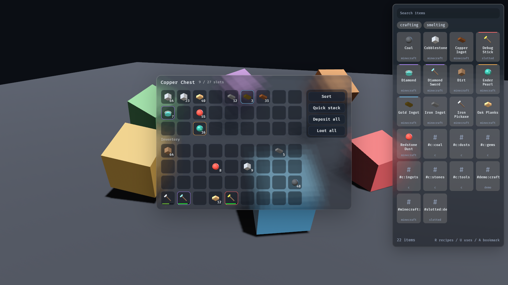
  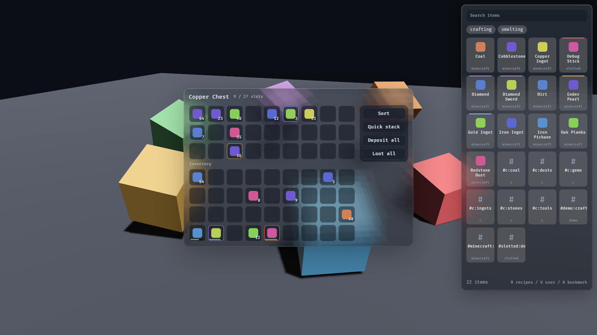
  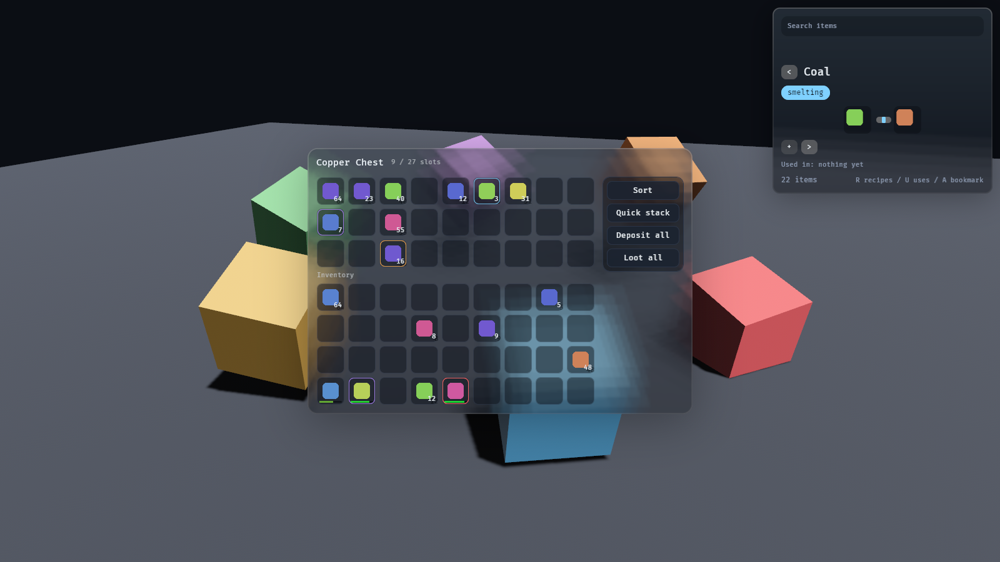
</p>
<p align="center">
  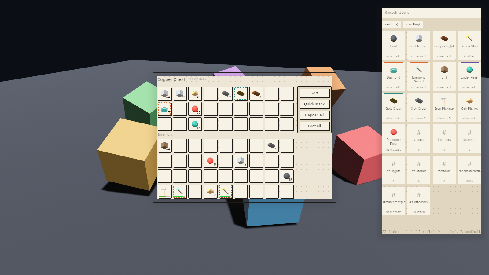
  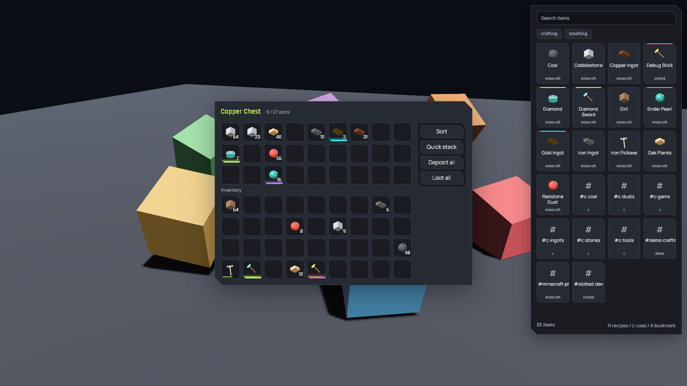
  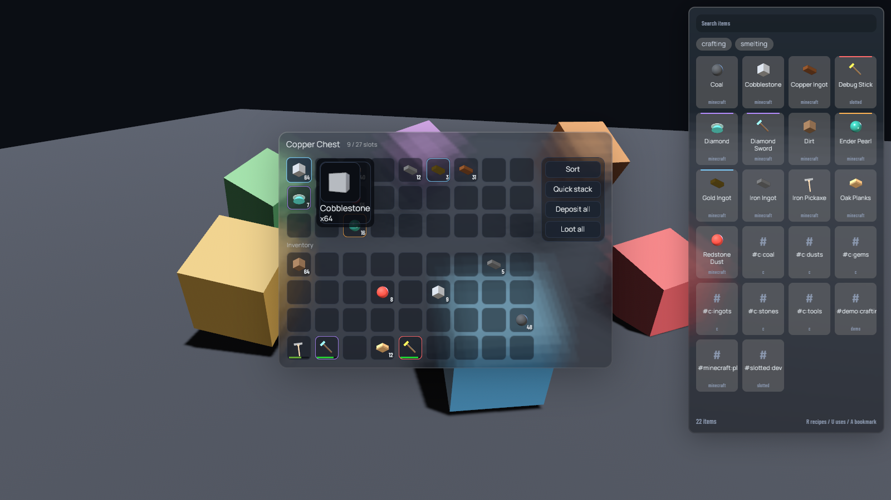
</p>
<p align="center">
  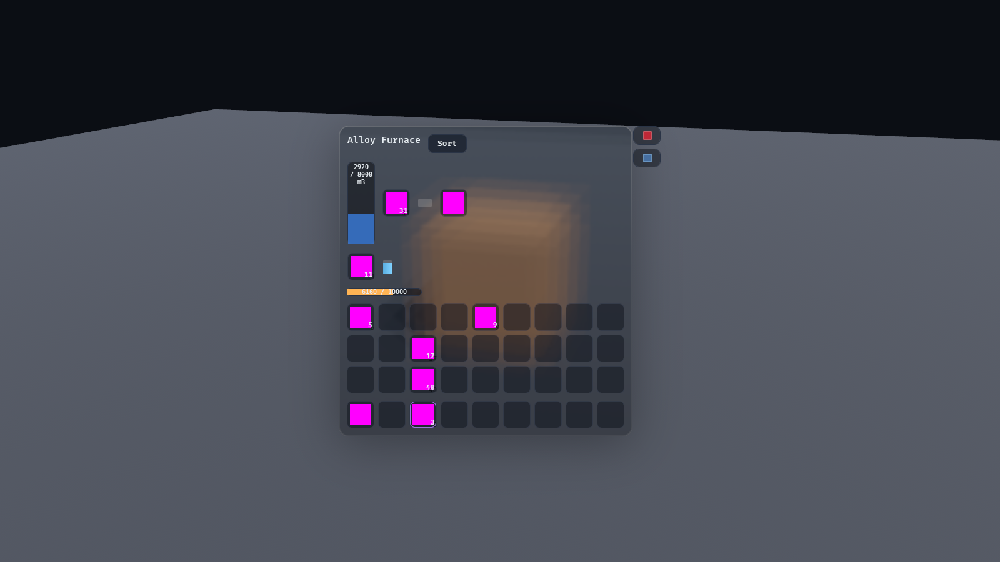
  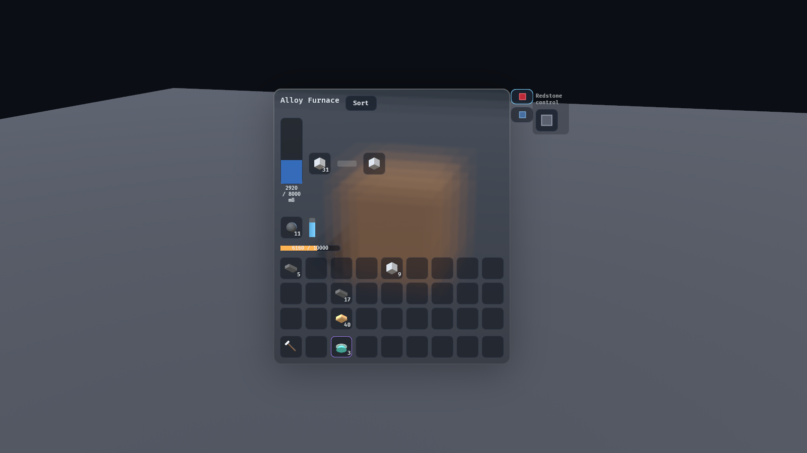
  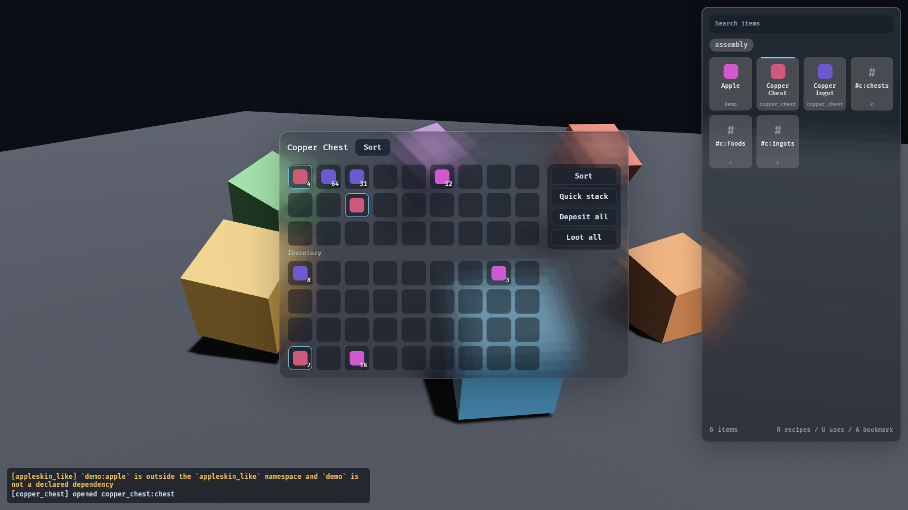
</p>

`just shot-chest`, `just shot-chest-themes`, `just shot-modded` and
`just shot-machine` recapture them. Every example takes `--theme <name>`, one
of `glass` (the default), `paper` or `neon`.

## Showcase

<https://jedimemo.github.io/bevy-slotted/>

One Bevy app, one wasm module, one page, nine scenes: the chest's interaction
model with the item browser beside it, a machine driven by menu properties, a
title, pause and settings on one screen stack, a dialogue over the furnace, the
three themes, the editable Lua mods, HUD layers, two networked clients over a
lossy link, and the test runner with a replayed recording. The rail on the left switches
scenes, the controls for the open one are on the right, and `?scene=<id>` links
straight to any of them.

<p align="center">
  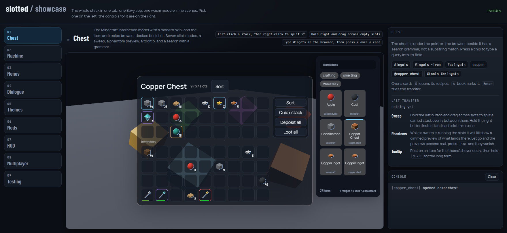
  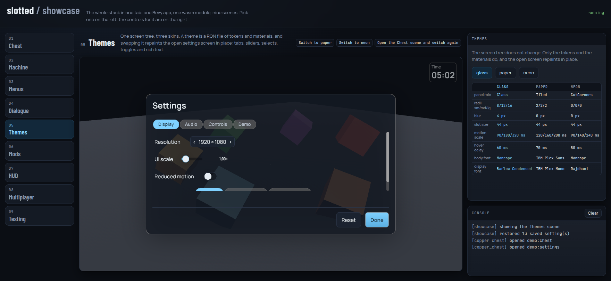
</p>

[`docs/guide/showcase.md`](docs/guide/showcase.md) says what each scene
demonstrates and which crate it exercises. `just playground && just serve` runs
it locally; `just shot-showcase` recaptures the nine screenshots under
`examples/web-playground/shots/`.

## Documentation

- [`docs/guide/`](docs/guide/) is the guide: [the showcase](docs/guide/showcase.md),
  [modding](docs/guide/modding.md),
  [screens](docs/guide/screens.md), [themes](docs/guide/themes.md),
  [testing](docs/guide/testing.md), [hot reload](docs/guide/hot-reload.md),
  [architecture](docs/guide/architecture.md).
- [`docs/guide/api/lua.md`](docs/guide/api/lua.md) is the Lua API reference,
  generated from the prelude by `cargo xtask gen-docs`.
- [`docs/guide/api/slotted.d.luau`](docs/guide/api/slotted.d.luau) is the type
  stub file for luau-lsp, generated by `cargo xtask luau-stubs`.
- [`docs/PLAN.md`](docs/PLAN.md) is the implementation plan: crate by crate,
  phase by phase, with the risks.
- [`docs/adr/`](docs/adr/) holds the architecture decision records.
- [`docs/design/`](docs/design/) holds each phase's contract and review notes.
- [`docs/research/`](docs/research/) holds the background the plan is built on.
- [`docs/moodboard.html`](docs/moodboard.html) is the visual direction.
- [`docs/FOLLOWUPS.md`](docs/FOLLOWUPS.md) is what each phase deferred.
- [`CONTRIBUTING.md`](CONTRIBUTING.md) is the workflow and the gates.

## Working on it

```
just check   # cargo check --workspace --all-targets
just test    # cargo test --workspace
just lint    # clippy, warnings fatal
just doc     # rustdoc for the workspace
just ci      # what CI runs: fmt-check, lint, test

just wasm-check   # every crate that has to reach a browser, on wasm32
just playground   # build dist/web-playground/
just serve        # then open http://127.0.0.1:8080/web-playground/
just smoke        # drive that page in headless Chromium
just shot-showcase  # one screenshot per showcase scene
just test-mods    # run every demo mod's tests/*.lua headless
```

The playground is the showcase: nine scenes over one wasm module, with the
four demo mods' Lua editable beside the canvas on the Mods scene. Edit
`control.lua`, press Run, and the mod reloads while the chest keeps its
contents. `just playground` needs
`cargo install wasm-bindgen-cli` at the version the lockfile pins;
[binaryen](https://github.com/WebAssembly/binaryen)'s `wasm-opt` is optional and
halves the module.

`.cargo/config.toml` forces a plain `cc`/`c++` toolchain. If your shell exports
an Anaconda toolchain, that is deliberate: ADR 0001 records how it corrupts a
vendored C++ build into a runtime `SIGFPE` rather than a build error.

## Licence

MIT OR Apache-2.0, at your option.
