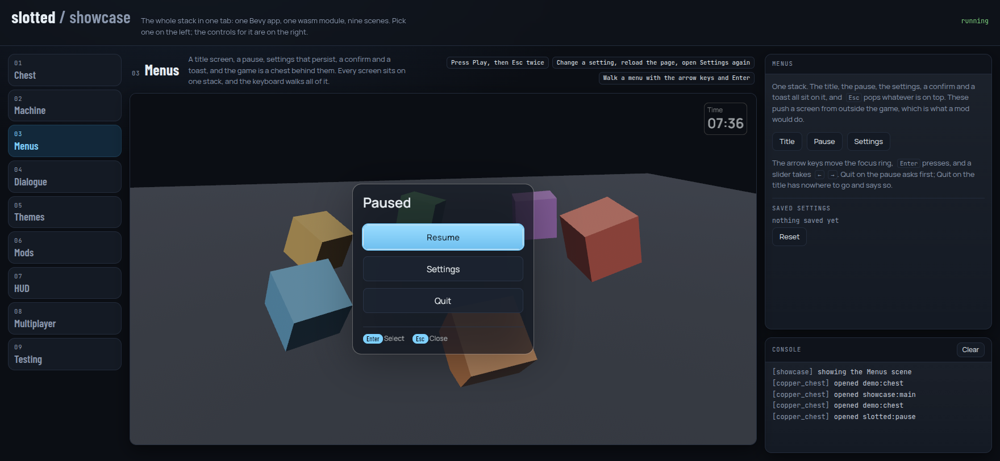
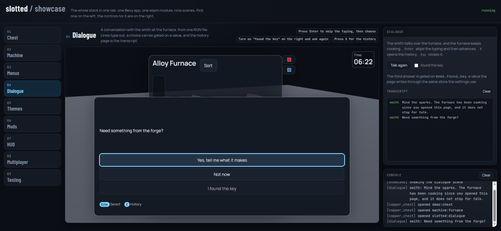

# The showcase

<https://jedimemo.github.io/bevy-slotted/>

One Bevy app, one wasm module, one page, nine scenes. The showcase is where
the whole crate graph is running at once and you can press on it, which is a
different thing from reading about it. This page says what each scene is for
and which crate it puts under load, so you can go from "that looked useful" to
the code that does it.

Run it locally with:

```
just playground   # build dist/web-playground/
just serve        # http://127.0.0.1:8080/web-playground/
```

A scene is not a separate app. The 3D backdrop is spawned once and its orbit
keeps going across a switch; a scene switch despawns the previous scene's
screens and menus and spawns its own, through the same request bus the page
uses for everything else. That is why the page never reloads and never shows
a second spinner.

## The scenes

| # | Scene | What it demonstrates | Crates it exercises |
|---|---|---|---|
| 1 | Chest | The Minecraft interaction model: seven click modes, sweeps, phantom previews, tooltips, and the item and recipe browser docked beside it. | `slotted-model`, `slotted-ui`, `slotted-theme`, `slotted-browser`, `slotted-registry` |
| 2 | Machine | Menu properties driving a tank, an energy bar, progress arrows and side tabs, plus a mod-injected button. | `slotted-ui`, `slotted-ecs`, `slotted-script` |
| 3 | Menus | A title, a pause, settings that persist, a confirm and a toast, all on one screen stack the keyboard walks. | `slotted-menu`, `slotted-ui` |
| 4 | Dialogue | A conversation from one RON file over the running furnace, with typed lines, a gated choice and a history page. | `slotted-menu` |
| 5 | Themes | The settings screen repainted from three RON token files, in place. | `slotted-theme`, `slotted-menu` |
| 6 | Mods | Four Lua mods, editable in the page, hot-reloaded into the running game. | `slotted-script`, `slotted-script-luaur`, `slotted-packs` |
| 7 | HUD | Layers anchored to the screen edges, from Rust and from a mod, and the position editor. | `slotted-ui` |
| 8 | Multiplayer | Two clients and a server in one tab over a lossy loopback link. | `slotted-net`, `slotted-ecs` |
| 9 | Testing | Lua tests driving the live screen, and a recorded session replayed through the input path. | `slotted-test`, `slotted-script` |

### 1. Chest

The screen from the moodboard, over the chest's own inventories. This is the
interaction model the whole project is built to get right: a left click picks
a stack up, a right click puts half down, holding a button and dragging across
slots sweeps a carried stack over them, and the slots a sweep will fill show a
dimmed phantom of what is about to land there.

The item browser is docked in the strip beside the chest. Search is a grammar
rather than a substring match: `#ingots` is a tag, `-iron` excludes,
`@copper_chest` is everything one mod owns, and the parts combine. The right
column offers the examples as chips that type themselves into the game's field,
and a readout of the last transfer the browser tried.

A recipe card knows whether the open screen could actually transfer it, which
is why pressing Enter over one either fills the grid or says why it cannot.

Read next: [screens.md](screens.md) for the node types, and
`crates/slotted-model` for the click table itself.

### 2. Machine

A furnace. The tank, the energy bar and the progress arrow are menu properties
the simulation writes each tick, not widgets the screen file animates; the
screen only says which property it draws. The two side tabs are the screen
file's. The redstone buttons in the right column stop the cook without
emptying the machine.

The **Sort** button in the action rail was injected by the `sorter` mod, which
was written against `slotted:any` and has never seen this screen. The same mod
puts the same button on the chest in the Mods scene.

### 3. Menus



A title screen, and the game behind it is the chest. Play opens the chest,
`Esc` closes it, and `Esc` again with nothing open pauses. The pause's Settings
opens the same settings screen the Themes scene shows, Quit asks first, and an
accepted Quit on the title has nowhere to go in a browser tab, so it says that
in a toast and shows the title again. About is a text page with a paragraph of
rich text in it, bold run and key-styled run included.

Every one of those is a screen on one stack, and the arrow keys and `Enter`
walk all of it. The three buttons in the right column push a screen from
outside the game, which is what a mod would do.

Settings persist. The game's settings store is a page-side store: a save is
handed to the page as RON, the page keeps it in `localStorage` under
`slotted.settings`, and hands it back before the first frame on the next
visit. Change a setting, reload the page, open Settings again and it is still
changed. The readout in the right column shows how much is stored and Reset
forgets it.

Read next: [menus.md](menus.md).

### 4. Dialogue



The smith talks to you over the furnace, and the furnace keeps cooking behind
the overlay. The whole conversation is one RON file compiled into the showcase
crate: a greeting, a choice with three answers, and an ending. Lines type out;
`Enter` skips the typing and then advances, `X` opens the history page, and
`Esc` closes it.

The third answer is gated on a value, `demo.found_key`, and greyed until it is
true. The switch in the right column writes that value through the same store
the settings use, so you can turn it on, press Talk again, and take the answer
that was closed a moment ago. Every line and every choice is also written to
the console as `[dialogue]`, and the transcript pane in the right column
collects those.

Read next: [dialogue.md](dialogue.md).

### 5. Themes

Three buttons and a table over the settings screen. The screen tree does not
change when you press one: a theme is a RON file of tokens, roles and
materials, and swapping it repaints whatever is open in place, which here
means tabs, sliders, selects, toggles and rich text, and the focused row and
every value stay where they were. The table beside the buttons is what
actually differs between the three shipped skins, generated from the RON files
by `tools/gen-theme-diff.py` rather than computed in the browser.

Read next: [themes.md](themes.md).

### 6. Mods

Today's playground, unchanged. Four Lua mods with their `data.lua` and
`control.lua` in an editor, a Run button, a Tests tab and a console. Edit a
file and press Run and the mod reloads into the running game with the chest's
contents intact.

On `wasm32` an uncaught Lua error aborts the whole module, which
[ADR 0004](../adr/0004-web-runtime-luaur.md) explains. Type `error("boom")` in
`control.lua` and press Run: the page notices the trap, builds a second module,
and hands the chest back to it.

Read next: [modding.md](modding.md) and [hot-reload.md](hot-reload.md).

### 7. HUD

No screen at all. A hotbar layer registered from Rust and a clock layer
registered from a bundled mod, both anchored to a screen edge rather than to a
menu. The edit button turns on the position editor a game would give its
players; the layout you drag into place is written to `localStorage` and put
back the next time you open the page.

### 8. Multiplayer

One server, one loopback link and two clients, all in this tab and all sharing
one chest container. The left client applies your click straight away and asks
the server; the server answers, and a prediction that turns out wrong is
corrected in front of you. The latency and loss sliders feed the link's
conditions, so a raised loss slider makes a retransmit visible in the message
log rather than theoretical.

The message log is its own pane, not the console: it is read for the sequence
of messages, which is a different job from reading what a mod printed.

### 9. Testing

Two halves. On the left, each mod's `tests/*.lua` run against the live screen,
one action per frame, and the pass and fail marks stream into the list as the
frames go by. On the right, a session recorded with `cargo run -p chest --
--record` replayed through the same input path the pointer uses, with a
scrubber that seeks to any frame.

Read next: [testing.md](testing.md).

## Getting around the page

- The rail on the left switches scenes. `Alt`+`1`..`9` does the same; plain
  digits stay the game's hotbar keys, and `Enter`, `Esc`, `X` and the arrows
  reach the game whenever the canvas has the focus.
- `?scene=<id>` opens a scene directly, and `?theme=<name>` opens it in one of
  the three skins. The ids are the lowercase scene names: `chest`, `machine`,
  `menus`, `dialogue`, `themes`, `mods`, `hud`, `multiplayer`, `testing`. An
  old `?scene=browser` link opens the Chest scene, where the browser now is.
- The console at the bottom of the right column is the game's, on every scene.
  Lines a scene writes for one pane (the Multiplayer message log, the Dialogue
  transcript) also go there.
- Two things outlive the tab, both in `localStorage`: the HUD layout under
  `slotted.showcase.hud` and the saved settings under `slotted.settings`. The
  Reset button on each scene's block forgets its key.
- A control whose export has not landed yet says `coming up` and stops
  responding rather than throwing. That is the page's normal state while a
  scene is being built, not a fault.

## Screenshots

`examples/web-playground/shots/showcase-<scene>.png`, one per scene.
`just shot-showcase` recaptures them: it opens each scene through its
`?scene=` link, checks the head strip against the scene table, poses the
scene (the Menus shot is the pause over the chest, the Dialogue shot is the
choice), captures it, drives the scene's controls, switches through the rail
on the way to the next one, and fails if anything but an expected `not yet:`
reached the browser console. It needs `just playground` and
`just serve` running first.
