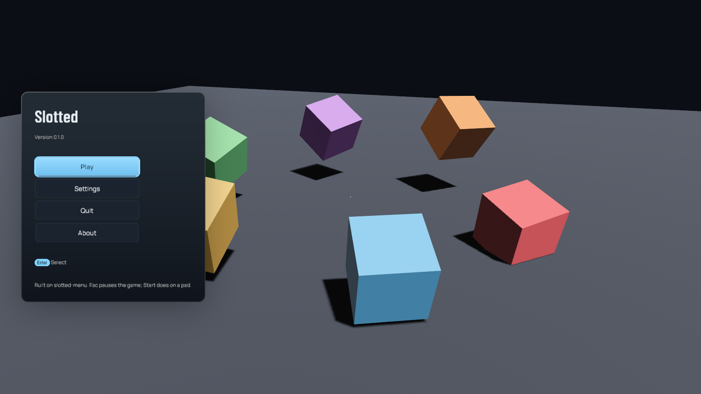
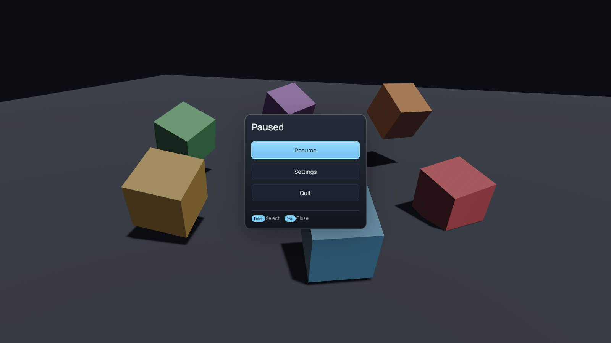
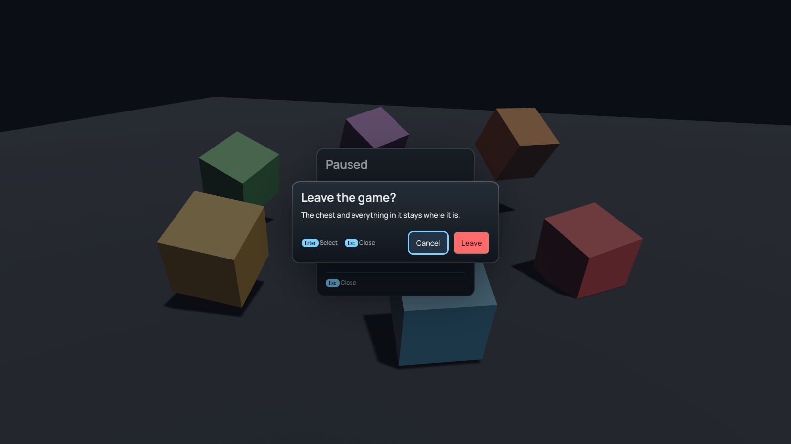
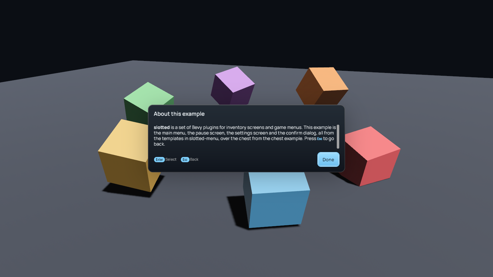
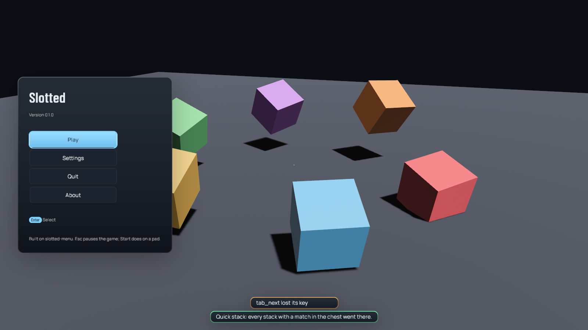
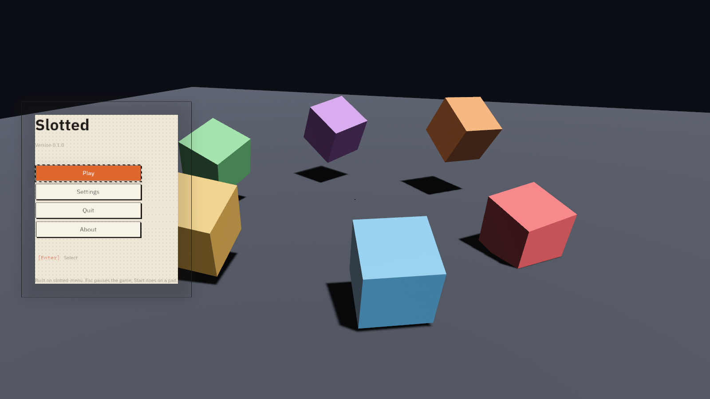
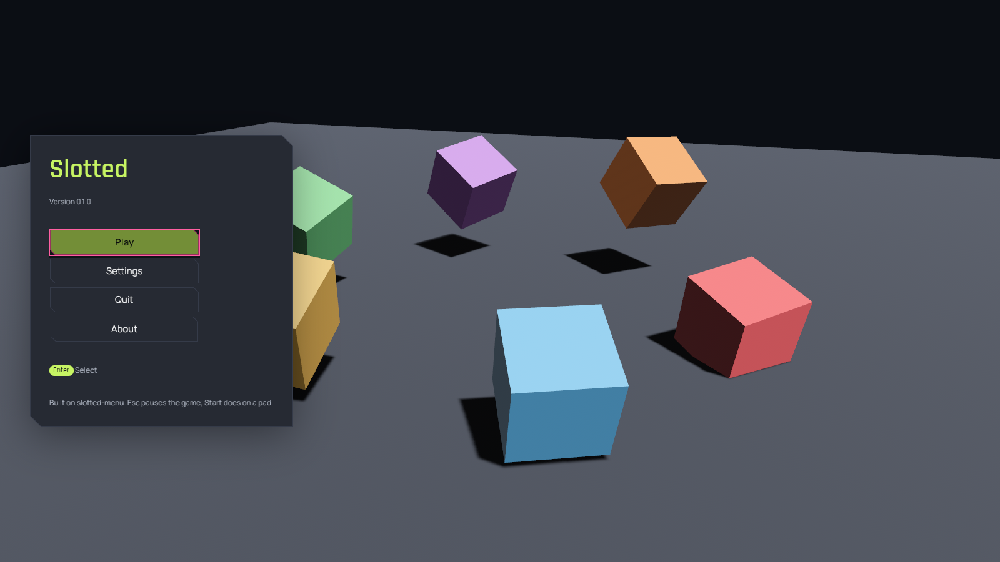

# menus

The game menus, in a window, over the chest example's scene. This is what a
game writes on top of `slotted-menu` to get a title screen, a pause screen,
settings that persist, a confirm dialog, a toast and a text page, and it is
short: a `MenuConfig`, a `Settings { spec }`, a `SettingsStorage`, one screen
file that inherits a template, one `Injection`, and two systems that answer
`MenuChoice` and `ConfirmResult` (`src/lib.rs`).

```
cargo run -p menus                 play with it
just shot-menus                    recapture the reference shots below
cargo test -p menus                the flow, by gamepad, headless
```

What to try: Play opens the chest; `Esc` closes it and `Esc` again pauses
(`Esc` is both `Back` and `Menu`; with a screen open it pops, with nothing
open it pauses). The pause's Settings opens the showcase settings screen, and
every value you change is saved to `slotted-menus/settings.ron` under the
system's temporary directory, so the next run starts where you left it. Quit
on the pause asks before going back to the title; Quit on the title asks
before leaving, with a danger button. About is a text page that a mod-style
injection added to the main menu template at its `buttons_end` anchor. The
chest's Quick stack button shows a toast. Everything works on a pad: Start
pauses, the d-pad walks, South selects, East goes back.

`--theme paper` and `--theme neon` swap the skin; `--shot <path>` with
`--main`, `--pause`, `--confirm`, `--page` or `--toast` captures that state
two seconds in and exits.

| | |
|---|---|
|  |  |
|  |  |
|  |  |
|  | |

`tests/flow.rs` opens the same plugin through `slotted_test::UiHarness` with
a memory settings store and walks main → play → back → pause → settings →
adjust a slider → back → quit → leave → title → quit → confirm → exit on the
pad, asserting the stack and the `MenuChoice`s at every step; it also proves
the injected About button is reachable by d-pad, that a quick stack toasts,
and snapshots the main menu, pause and confirm trees in three themes. The
guide is [`docs/guide/menus.md`](../../docs/guide/menus.md).
